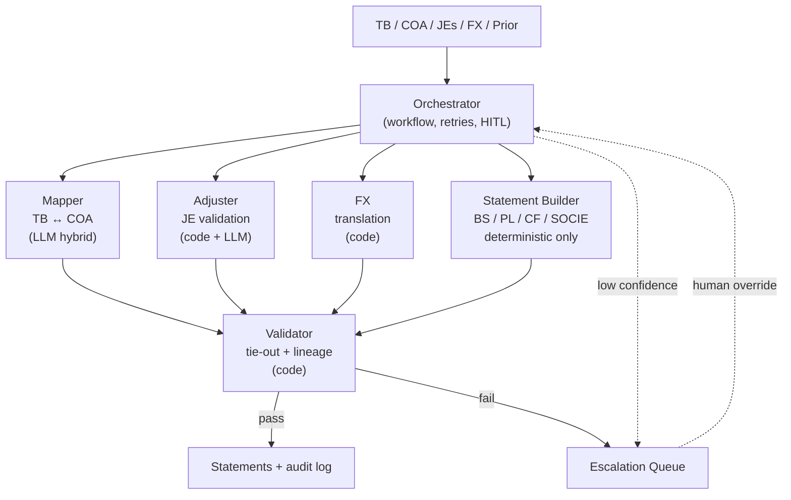
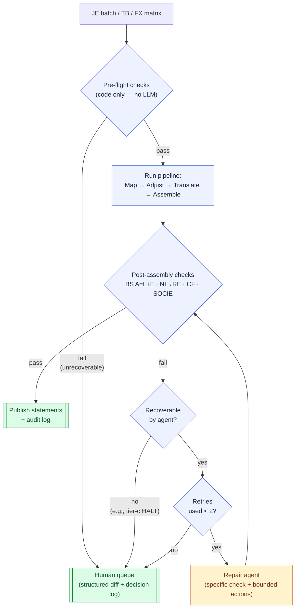
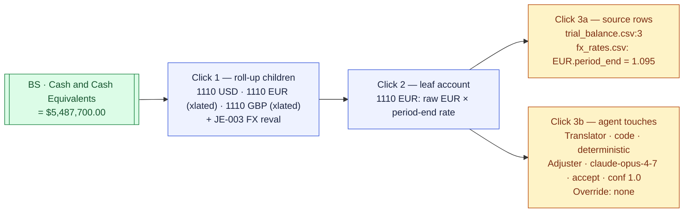

# Agentic Financial Statement Generation — Architecture

> **Scope.** This document describes the architecture for an agentic system
> that ingests a trial balance, a chart of accounts, and a batch of manual
> adjustments, and produces the four primary financial statements (BS, P&L,
> Cash Flow, SOCIE) with audit-grade traceability.
>
> The companion prototype in `prototype/` instantiates one slice of this
> architecture — the **Manual Adjustments Agent** — end-to-end against the
> seeded messy inputs.

---

## 1. Problem framing

"Generate financials" is not one problem. It decomposes into seven
sub-problems with very different reliability bars:

| # | Sub-problem | Reliability bar | Suited to |
|---|---|---|---|
| 1 | Ingest TB / COA / adjustments | Lossless, idempotent | Code |
| 2 | FX translation | Deterministic, exact | Code |
| 3 | COA mapping for unknown accounts | Best-effort, with confidence + HITL | LLM-assisted |
| 4 | Manual-adjustment validation | Mixed: structural=exact, semantic=fuzzy | Code + LLM |
| 5 | Statement assembly (roll-up to BS/PL/CF/SOCIE) | Arithmetic, exact | Code |
| 6 | Tie-out validation (A=L+E, NI→RE, cash continuity) | Exact | Code |
| 7 | Traceability + auditor narrative | Lossless lineage; prose explanations | Code (lineage) + LLM (prose) |

Reading down the table tells you where AI earns its keep and where it
doesn't. **Five of the seven sub-problems are arithmetic; the LLM is
load-bearing on two and a half** (mapping, semantic validation, prose).

This decomposition drives every architectural choice that follows.

---

## 2. Agent topology

### Choice: orchestrator + narrow specialists + deterministic core

Not a single mega-agent with tools. Not a flat swarm. A thin orchestrator
that routes work to specialist agents, with the **statement assembler
implemented as plain code, not an agent**.



Of the six boxes above, **only the Mapper and Adjuster invoke the LLM** — and
even then the LLM is gated by code-generated candidate sets, never given free
rein. The Validator decides pass/fail; on fail or low confidence, the
Orchestrator routes to the Escalation Queue (human queue), which can re-enter
the workflow with an override event.

### The five specialist agents in detail

| Agent | Purpose | Inputs | Outputs | LLM use |
|---|---|---|---|---|
| **Mapper** | Resolve unknown account codes to existing COA nodes; detect renamed accounts across periods. | TB row or JE line with unmatched code; COA; prior-period TB; optional history of human overrides. | Ranked candidate list with confidences; `decision = {auto-accept, suggest, escalate}`. | LLM **chooses** among code-generated candidates; never mints a code. Confidence below `min_mapping_confidence` → escalate. The interface is in `prototype/adjuster/deterministic/mapper.py` with the prefix-similarity selector; the production LLM selector is the documented seam. |
| **Adjuster** | Validate manual JEs (the slice built in `prototype/`). | One JE at a time; COA; period config. | `Finding[]`, `Decision ∈ {accept, quarantine, reject}`, mapping suggestions, plain-English explanation. | Used **only** for prose; arithmetic/structural checks are pure code. |
| **FX** | Translate non-functional-currency balances to USD using the rate matrix; compute opening/closing CTA. | TB rows tagged with currency; `fx_rates.csv`; prior-period closing rates. | Per-row USD amount with rate used + source citation; CTA delta to `3310`. | None. Pure arithmetic. Block the run on missing required rate. |
| **Statement Builder** | Roll up post-adjustment, post-translation TB into BS / P&L / CF / SOCIE per the COA hierarchy. | Final TB after Mapper, Adjuster, FX; COA tree; prior-period statements for comparatives. | Four statements + lineage graph (every cell → contributing source rows). | None. Anti-pattern to use one. |
| **Validator** | Cross-statement tie-outs and lineage integrity. Decides whether the Orchestrator may publish. | All four statements + lineage graph + open quarantine items. | `pass` (publish) or `fail` (route back to Orchestrator with named check + offending data). | None. Each check is a one-line identity. |

The Orchestrator itself is plain workflow code: it does not reason, it routes.
It maintains the retry budget (max 2 per check), the escalation queue, and
emits one event per agent invocation to the audit log.

### Why specialists, not one big agent

- **Narrow prompts beat broad ones.** The Adjuster's prompt sees one JE at
  a time. The Mapper's prompt sees one unmapped account plus a code-ranked
  candidate list. Each can be evaluated independently with a fixture set.
- **Cheaper to swap for code.** Today the Mapper uses an LLM to choose
  among candidates. Tomorrow, with enough labeled mappings, it becomes a
  classifier. The interface is the same.
- **Failure isolation.** A bad LLM response in the Mapper does not corrupt
  the Assembler's arithmetic. The orchestrator quarantines that JE and
  proceeds.

### Why the Assembler is not an agent

Generating a balance sheet from a clean, post-adjustment TB is roll-up
arithmetic against a hierarchy. There is exactly one correct answer. An LLM
in this path would introduce non-determinism, hallucination risk, and
opacity for zero upside. **An agent here would be an anti-pattern, and the
brief explicitly warns against it.**

---

## 3. The deterministic / LLM line

The single most important diagram in this document.

| Concern | Implementation | Why |
|---|---|---|
| TB / COA / adjustment ingestion | **Code** | Lossless, schema-bound |
| Double-entry validation (debits = credits) | **Code** | Single source of truth: arithmetic |
| Account existence check | **Code** | Set membership |
| Header-vs-leaf posting check | **Code** | Tree property |
| Date-in-period check | **Code** | String compare |
| FX translation (each currency × each balance × rate) | **Code** | Multiplication |
| Hierarchical roll-up to statement lines | **Code** | Tree traversal |
| BS tie-out (A vs L+E), NI→RE, cash continuity | **Code** | Identities |
| Idempotency keys + event log | **Code** | Hashing + append |
| Lineage graph (cell ↔ source rows) | **Code** | Graph |
| Mapping candidate generation for unknown account | **Code** | Hand-rolled pure mathematics: numeric-prefix similarity + Levenshtein edit-distance ratio + Jaccard token overlap, blended 70/30 (in the prototype today). Production extends the same blend with name embeddings and an LLM selector. |
| Mapping candidate **selection** + confidence | **LLM** | Fuzzy semantic match |

> **Prototype simplification.** The shipped Adjuster slice uses three
> hand-rolled pure-math signals — numeric-code prefix similarity, Levenshtein
> edit-distance ratio, and Jaccard token overlap — blended `0.7 · prefix +
> 0.3 · (lev + jac) / 2`. Every line of math is in `validators.py`; there is
> no third-party fuzzy-string library and no LLM in the selection. This is
> enough to suggest `6310 Travel and Entertainment` for the unmapped `6315`
> (memo "Conf travel") in JE-005 at confidence 0.60, but it is not the
> production Mapper. The production Mapper takes the same candidate set plus
> name embeddings, parent-code hint, prior-period analogues, and amount
> magnitude, and asks the LLM to pick one with a confidence score. The
> interface is the same; only the selector implementation differs.
| Memo coherence ("does the prose match the lines?") | **LLM** | Language understanding |
| Plain-English rejection / quarantine explanation | **LLM** | Prose for non-technical users |
| Reconciliation narrative ("explain every delta") | **LLM** | Summarization over labeled deltas |
| Anomaly flagging on JE narrative + amount + date | **LLM** | Pattern recognition |

**The single load-bearing rule:** *the LLM never produces a number that ends
up on a statement.* It produces labels, rankings, confidences, and prose.
Every dollar on the BS is sourced via deterministic arithmetic from a TB row
or a JE line.

---

## 4. Data and lineage model

### Append-only event log; statements are projections

Every input row, every transformation, every agent decision becomes an event.
The four financial statements are **projections over the event log at a
given period-end** — never the source of truth themselves.

This has three consequences:

1. **Re-running is free.** Replay the log → identical statements. Idempotency falls out.
2. **Human override is a first-class event** ("analyst X mapped 9999 → 1150"), not a hack.
3. **Drilldown is a graph query**, not a heroic reverse-engineering exercise.

### Lineage graph

Every node carries:

```
{
  "node_id": "stmt:BS:2024Q4:cash",
  "value": 5_487_700.00,
  "components": [
    {"node_id": "tb:1110:USD",    "amount": 4_250_000.00, "source": "trial_balance.csv:2"},
    {"node_id": "tb:1110:EUR:fx", "amount":   903_813.00, "source": "trial_balance.csv:3 × fx_rates.csv[EUR.period_end=1.095]"},
    {"node_id": "tb:1110:GBP:fx", "amount":   ?         , "source": "BLOCKED: missing GBP period_end rate"},
    {"node_id": "je:JE-003:L1",   "amount":    11_200.00, "source": "manual_adjustments.json#JE-003.lines[0]"}
  ],
  "agent_touches": [
    {"agent": "Translator", "model": null, "deterministic": true},
    {"agent": "Adjuster",   "model": "claude-opus-4-7", "decision": "accept", "confidence": 1.0}
  ]
}
```

### What an auditor does

Click any cell on the BS → graph returns its components → click a component →
its source (CSV row, JE id, FX rate) and any agent touch with prompt + model
+ confidence + override status. Done in three clicks, no reverse-engineering.

---

## 5. Failure modes — every one mapped to a detector and a response

The brief lists five. The seeded data has more. Both are covered below.

| # | Failure mode | Detector | Response |
|---|---|---|---|
| 1 | Hallucinated account mapping | Code generates the candidate set; the LLM **only chooses** | Hard guarantee: agent cannot mint a code that doesn't exist |
| 2 | Debits ≠ credits after adjustments | Code (sum check) | Reject JE; explain in plain English |
| 3 | Account fits no COA node | Code (set membership) | Quarantine; surface ranked candidates with confidence |
| 4 | FX rate gap (period-end or period-average) | Code (rate matrix completeness) | Use the most recent available rate from `fx_rates.csv`; flag the cell as `ESTIMATED RATE—period-end unavailable`; emit a structured fallback event to the audit log. **Do not halt** the close (per Amit Patel email 2026-04-30). Interpolation and external-API calls are forbidden — work only with what is in `fx_rates.csv`. |
| 5 | Circular intercompany entry | Code (per-account net, # accounts touched) | Quarantine — technically valid, economically null |
| 6 | Duplicate account codes in TB (e.g., `6310` ×2) | Code (groupby) | Sum + log; benign pattern |
| 7 | Ambiguous `cf_category` (`TBD` on `1150`, `2170`) | Code (enum check) | Default to Operating + flag for human |
| 8 | COA header with no children (`1290 Other Assets`) | Code (tree integrity) | Allow + emit info-level lineage note |
| 9 | Renamed accounts across periods (`6905` retired) | Code (set diff prior vs current) | Surface; LLM proposes successor mapping |
| 10 | TB orphan (`9999 Suspense - Unmapped`) | Code | Post to `_UNMAPPED` BS bucket; warn |
| 11 | Sign-flippy contra (`7310` typed Expense holds credit) | Code (sign vs normal_balance + magnitude) | Allow; flag if exceeds materiality |
| 12 | Posting to a header account | Code (account_type == "Header") | Reject |
| 13 | JE date outside reporting period | Code (string compare) | Reject |
| 14 | LLM returns malformed JSON | JSON-schema validation in tool layer | Retry once with strict schema; on second failure → human queue |
| 15 | TB raw imbalance > materiality | Code | Block run; surface diff |
| 16 | Mapping confidence below threshold | Code (config.min_mapping_confidence) | Escalate to human regardless of LLM choice |

The columns matter more than the rows. Notice that **the detector is
overwhelmingly code** — the LLM contributes to *response* (prose, mapping
selection), not to *detection*.

### Why the agent cannot hallucinate a mapping

Brief asks specifically about hallucinated mappings. Here's the guarantee:

```
unknown_account = "6315"
candidates      = code.generate_candidates(unknown_account, coa)   # only real codes
selected        = llm.choose_one(candidates)                       # bounded set
assert selected.code in {c.code for c in candidates}               # invariant
assert selected.code in coa                                        # double-check
```

There is no path by which the LLM can return a code that doesn't exist in
the COA. If it tries, the assertion fires before the code reaches the
event log.

### Tiered handling for unbalanced JEs

The policy below was confirmed by Amit Patel on **2026-04-30**. Three named
tiers, all gated by `prototype/adjuster/config.py` and all logged.

| Tier | Trigger | Response | Audit |
|---|---|---|---|
| **a — auto-correct** | abs(diff) ≤ $500 (FX rounding scope) | Plug routed to `7300 FX Gain/Loss - Realized` (or configured rounding account); decision = **accept**; raw `UNBALANCED` finding is replaced with `AUTO_CORRECTED` (info). | A structured `auto_correction` event is appended to `audit_log.jsonl` carrying source entry, delta, action, and plug. **Never silent** — Amit's exact phrasing. |
| **b — warn band** | $500 < abs(diff) ≤ $10,000 and a single-line fix is proposable | Decision = **accept**; UNBALANCED is replaced with `IMBALANCE_WARN` (warning); `proposed_fix` surfaced; statement is produced with a reconciliation note. **Do not halt** — reviewer sign-off required before close. | The `IMBALANCE_WARN` finding event is itself the reconciliation-note record. |
| **c — halt** | abs(diff) > $10,000, **or** warn-band imbalance with no proposable single-line fix, **or** BS does not foot (Assets ≠ Liabilities + Equity) | HALT — decision = **reject** at the JE level; surface a structured error to the user before any output for the BS-level case. | Standard `finding` + `decision` events; the raw `UNBALANCED` (error) is preserved. |

**JE-002 in the seeded data ($3,500 imbalance) is a tier-b case** and the
prototype handles it that way: code computes the proposal (which line, what
target amount), the entry is **accepted with a reconciliation note**, and
`proposed_fix` is surfaced for the reviewer. The proposal is never
auto-applied — the LLM (when used) only writes the rationale prose around
it. Same architectural rule as everywhere else: code does the math, LLM does
the prose.

The function is `propose_balance_fix` in `prototype/adjuster/deterministic/validators.py`
and the warn-band integration is exercised by
`tests/test_integration.py::test_je002_warn_band_with_proposal`. The tier-a
auto-correction path is exercised by
`tests/test_integration.py::TestAutoCorrectionEvent` via a synthetic
sub-$500 imbalance, since no seeded JE falls in that range.

#### This-slice extension of Amit's tier-a

Amit's tier-a is worded for FX rounding specifically. The Adjuster slice
does not run FX translation, so it cannot distinguish FX-rounding noise
from arbitrary sub-$500 imbalance. We apply tier-a uniformly to any sub-$500
JE imbalance, with the plug routed to the configured rounding account and
the `auto_correction` audit event emitted regardless of source. Reviewers
who want a stricter read can lower `materiality.fx_rounding_abs` to 0; the
behavior is config-driven, not hard-coded.

---

## 6. Defects discovered in the sample data

The brief explicitly named three defects. Inspection of the seeded files
turned up additional issues that any production run would have to tolerate
or escalate. Each is listed with its file, the agent that owns it, and the
chosen response.

| # | Defect | Source | Owning agent | Response |
|---|---|---|---|---|
| D1 | Header `7000 Non-Operating Items` has empty `normal_balance`; sibling header `8000 Income Tax Expense` has `Debit`. Inconsistent COA hygiene. | `chart_of_accounts.csv:65,71` | Mapper / COA loader | Tolerate (header rows do not post); emit warning so the COA owner can clean it. |
| D2 | Equity accounts `3200 Retained Earnings`, `3300 Accumulated OCI`, `3310 FX Translation Reserve` have empty `cf_category`. Defensible (equity flows are derived) but should be tagged `Financing` for the dividends-paid / treasury cases. | `chart_of_accounts.csv:37-39` | Mapper | Default to `Financing` with a flag; surface as info-level finding. |
| D3 | Five contra accounts hold the opposite of their parent's normal balance: `1121` (Allowance for Doubtful Accounts, Asset/Credit), `1211` (Accumulated Depreciation, Asset/Credit), `1221` (Accumulated Amortization, Asset/Credit), `3400` (Treasury Stock, Equity/Debit), `4200` (Sales Returns and Allowances, Revenue/Debit). | `chart_of_accounts.csv` | Adjuster (sign rules) / Statement Builder | Recognize as legitimate contra accounts; do not flag sign mismatch when account is in the contra registry. |
| D4 | USD has no `opening` rate in `fx_rates.csv`. Trap: the FX agent must know functional-currency rows are exempt from rate lookup, not silently fall back to `1.0` for every currency. | `fx_rates.csv` (rows 5-6 only `period_average` + `period_end` for USD) | FX | Hard-code: if `currency == functional_currency`, skip rate lookup. Any other missing rate → fall back to the most recent available rate from `fx_rates.csv`, flag the cell as `ESTIMATED RATE—period-end unavailable`, log the fallback. **Do not halt** (per Amit Patel email 2026-04-30). Interpolation and external-API calls are forbidden. |
| D5 | JEs lack production metadata: no `approver`, `evidence_link`, or `posted_by` fields. Acceptable for a prototype, blocker for production audit (SOX 404 evidence). | `manual_adjustments.json` (every entry) | Ingestion schema | Make the fields optional in the prototype with a per-JE warning when absent; require them in production via schema enforcement at the API boundary. |
| D6 | **Order-of-operations trap.** JE-003 ("EUR cash uplift to period-end rate") is itself an FX-revaluation entry. If the FX agent translates the EUR cash balance *and* the Adjuster posts JE-003, the FX gain is double-counted. The pipeline must apply manual adjustments **before** running FX translation, or treat JE-003 as a pre-translation artifact and skip it during translation. | `manual_adjustments.json#JE-003` × `fx_rates.csv` | Orchestrator (pipeline ordering) | Documented order: ingest → map → **adjust** → translate → assemble → validate. The Orchestrator pins this order; an out-of-order run is a configuration error, not an agent decision. |

The columns matter: each defect has a clearly owning agent and a named
response. None are "the LLM will figure it out."

### Why this list matters

Five of these six defects are **not** in the brief. Three of them (D2, D4,
D6) would silently corrupt a financial statement if the agent treated them as
clean data. The architecture has to plan for them before they arrive — which
is the whole point of the brief's "do not sanitize the inputs first."

---

## 7. Validation and self-correction loop

### Two phases of checks

**Pre-flight** (before any LLM call):

- TB total debits = total credits (within materiality)
- All TB account codes exist in COA *or* are routed to suspense
- All adjustment account codes exist in COA *or* trigger mapper
- FX rate matrix has every (currency × type) cell needed for this run
- Adjustment dates fall in the reporting period

**Post-assembly** (after statements are built):

- BS: assets = liabilities + equity (within `bs_tieout_abs`)
- P&L: net income flows to RE delta in SOCIE
- CF: closing cash = opening cash + Δoperating + Δinvesting + Δfinancing
- SOCIE: opening equity = prior period closing equity (cross-period continuity)

If a check fails, the orchestrator does **not** ask an LLM to "figure it
out." It runs the bounded recovery loop below — code decides
recoverability, code enforces the retry cap, code passes the **specific**
failed check (not a generic "fix it" prompt) into a repair agent with a
**whitelisted** action surface.



Three properties matter:

1. **Bounded retries.** Two attempts max; no infinite loops, no token
   bonfires.
2. **Specific instructions.** The agent is told *exactly which check
   failed*, not asked to rediscover the problem.
3. **Bounded action surface.** A repair agent can only take whitelisted
   actions for that check. The repair agent for a TB imbalance cannot
   modify a JE; it can only propose a rounding plug under materiality.

---

## 8. Auditor's-eye traceability

Demo: an auditor opens the BS and clicks on **Cash and Cash Equivalents**.
Three clicks reach the original CSV row + every agent decision that
touched the number.



Every arrow above is a deterministic graph query against the append-only
event log from §4. **No LLM is invoked at audit time** — auditing is
read-only against frozen events, so reproducibility is a property of the
data structure, not a property of the model.

### What this gives the audit team

- **Reconciliation in minutes, not days.** No "where did this number come
  from" reverse engineering.
- **Reproducibility of agent decisions.** Prompt + model id + version are
  pinned on the event; the same input replays to the same output (modulo
  model determinism, which is itself logged).
- **Human override as data.** If an analyst overrode a mapping, the
  original suggestion, the override, the analyst id, and the timestamp are
  all on the record.

---

## 9. What's deliberately out of scope

Naming these explicitly so reviewers know what is *known unknowns* vs
*unknown unknowns*:

- **Multi-entity consolidation.** Per-entity TBs, eliminations matrix,
  minority interest, currency translation adjustment for foreign subs.
- **Intercompany elimination.** A real IC matrix, not just per-JE
  validation.
- **Tax provisioning.** Current vs deferred, valuation allowance,
  uncertain-tax-position roll-forward.
- **Period locking and re-open workflow.** Once Q4 is closed, what
  happens to a prior-period correction.
- **GAAP ↔ IFRS treatment differences.** Lease accounting, revenue
  recognition, R&D capitalization.
- **Statement formatting / branding.** A real UI for finance reviewers vs
  the prototype's plain Markdown report.

All are real and important. None are required to demonstrate the
architectural pattern.

---

## 10. The prototype slice (`prototype/`)

The Adjuster specialist from §2 is built end-to-end. It instantiates the
architecture above:

- **Deterministic validators** in `prototype/adjuster/deterministic/validators.py`:
  balance, account existence, header check, sign rules, date check,
  circular-IC detection, mapping candidate generation. **Zero LLM
  involvement.**
- **Decision logic** in `prototype/adjuster/deterministic/pipeline.py`: hard structural
  errors → reject; recoverable findings (unmapped, circular) → quarantine;
  clean → accept. Configurable thresholds in `config.py`.
- **LLM explainer** in `prototype/adjuster/deterministic/llm.py`: optional, with a
  deterministic template fallback so the prototype runs zero-deps. The
  LLM only writes prose; it does not validate, decide, or generate
  mappings.
- **Event log** as JSONL in `output/audit_log.jsonl`: every finding is one
  line, replayable.
- **Test fixture** in `prototype/tests/test_validators.py`: pins the
  expected decision for all 10 seeded JEs. Currently 10/10 passing.

Run:

```bash
cd prototype
python3 main.py --inputs ../inputs --out output
python3 -m unittest discover tests
```

Output on the seeded inputs (8 accept / 2 quarantine / 0 reject):

| JE | Decision | Why |
|---|---|---|
| JE-001 | accept | Balanced |
| JE-002 | accept (warn) | Debit 28,500 ≠ credit 25,000; $3,500 imbalance → tier-b warn band: accepted with `IMBALANCE_WARN` finding and reconciliation note; proposed fix raises credit line to 28,500 (85% conf) for reviewer sign-off. |
| JE-003 | accept | Balanced FX reval |
| JE-004 | accept | Balanced bad debt |
| JE-005 | quarantine | `6315` not in COA → suggests `6310` (75% conf) |
| JE-006 | accept | Balanced depreciation |
| JE-007 | accept | Balanced deferred-tax |
| JE-008 | quarantine | Same account `2170` debited and credited — null |
| JE-009 | accept | Balanced legal accrual |
| JE-010 | accept | Balanced LT-debt reclass |

---

## 10b. The LangGraph + RAG variant — a deliberate counter-example

`prototype/adjuster/langgraph/graph.py` ships a second implementation of the Adjuster
that does the opposite of the rule in §3 — it lets the LLM run the
structural, existence, and semantic checks, with policy and COA snippets
retrieved from a Chroma vector store. Six LangGraph nodes, three of them
in parallel via a reducer-backed `findings` channel.

```
START ─┬──► structural ──┐
       ├──► existence  ──┼──► aggregate ──► decide ──► explain ──► END
       └──► semantic   ──┘
```

This variant is **not** the recommended path. It's included because the
brief asks how I would build the system, and the strongest argument for
"code does the math; LLM does the prose" is to ship the alternative
side-by-side and let a reviewer compare. The Streamlit "Compare" view
renders all three modes per JE — deterministic, LLM-prose-only, and
LangGraph + RAG — so the gap is observable, not asserted. Run with
`python3 main.py --llm-mode graph` after `pip install -r
requirements-llm.txt`.

What you see in the trace explorer when you click any JE in the LangGraph
column:

| Node | Touches | Cost |
|---|---|---|
| `structural` | RAG over `adjuster_policy` (3 snippets); LLM judges balance/sign/date | ~600 input tokens, ~150 output |
| `existence` | RAG over `coa_accounts` (5/line); LLM picks per line | scales with line count |
| `semantic` | No RAG; pure LLM memo-coherence check | ~400 in / ~100 out |
| `aggregate` | Pure code dedup | 0 |
| `decide` | RAG over policy; LLM applies tier rules | ~500 in / ~80 out |
| `explain` | Reuses `llm.explain` — same prose path as the prose-only mode | ~300 in / ~120 out |

The takeaway lands in the comparison: every LLM call is a place where the
deterministic path returns the right answer in microseconds, for free,
deterministically, with the source of the answer visible in
`validators.py`. The LangGraph variant is technically interesting and
operationally inferior. That's the lesson the brief is asking the
candidate to learn.

### Observed run-to-run variance

This is not a hypothetical. Two consecutive runs of `--llm-mode graph`
against the seeded 10 JEs produced different headline counts:

| Run | accept | quarantine | reject | What flipped |
|---|---|---|---|---|
| 1 | 8 | 2 | 0 | Matches deterministic exactly. |
| 2 | 9 | 1 | 0 | **JE-005 went accept**, even though the `existence` node correctly emitted `UNMAPPED_ACCOUNT` for code `6315`. The `decide` LLM overrode it. |

The deterministic pipeline catches `UNMAPPED_ACCOUNT` in
`QUARANTINE_CODES` (`prototype/adjuster/deterministic/pipeline.py:39`) so
the decision is locked before any LLM sees it. In the graph variant only
`HARD_ERROR_CODES` get the code-fast-path; `UNMAPPED_ACCOUNT` and
`CIRCULAR_NET_ZERO` flow into the LLM `decide_node`, where they are at
the mercy of whatever the model happens to weight on that draw. Same
input, same prompts, same temperature, different decision — exactly the
property the brief is warning against when it says "AI tools may
behave differently across runs."

The fix in the deterministic path is one line — add the codes to a
fast-path set. The fix in the LangGraph path is to keep adding code
guardrails until the LLM is no longer making decisions, at which point
you have rebuilt the deterministic path with extra steps and a 5,000×
cost premium. That's the architectural argument made concrete.

## 11. Summary in five bullets

- **Code does the math; LLMs do the labels and the prose.** The LLM never
  produces a number on a statement.
- **Specialists, not a swarm.** One orchestrator, four narrow agents
  (Mapper, Adjuster, Translator, Auditor), one deterministic Assembler.
  Agents that don't earn their LLM are downgraded to code.
- **Statements are projections over an append-only event log.**
  Re-running is free; auditing is a graph query.
- **Every failure mode has a named detector and a named response.** The
  retry loop is bounded and the LLM is told exactly what to fix.
- **The COA is the product.** Every interesting failure in the seeded data
  is, at root, a COA-quality problem. Get that right and the agent is
  almost easy.
